### Login

ReadySetCyber dashboard users can only access the platform after completing a ReadySetCyber
questionnaire and registering with their associated e-mail. You will then be prompted to
create a user account.

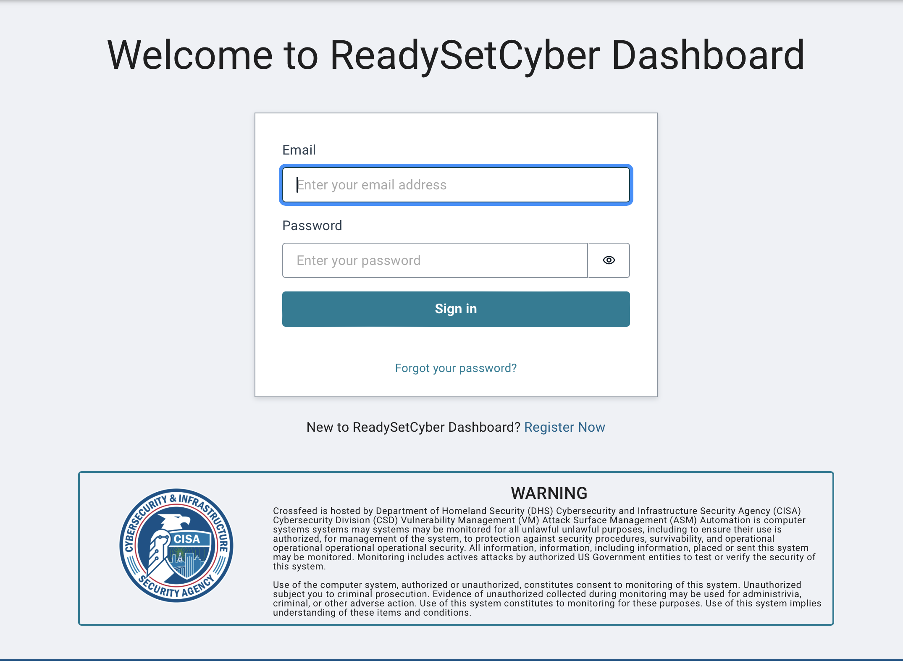

#### New Users

New users will navigate to the ReadySetCyber Dashboard login and click ”Register Now”.

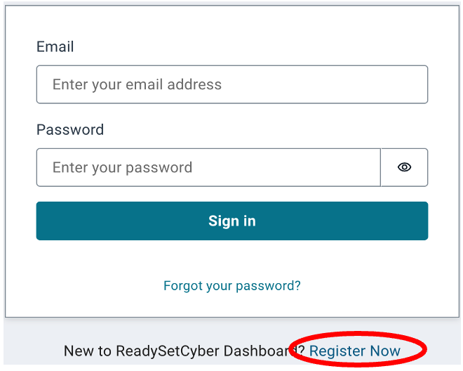

Enter the e-mail, First and Last name associated with the completed ReadySetCyber assessment.

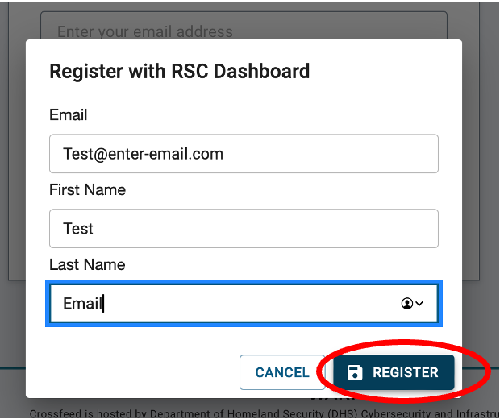

Once registration is complete, a new user will receive an e-mail with further registration steps.

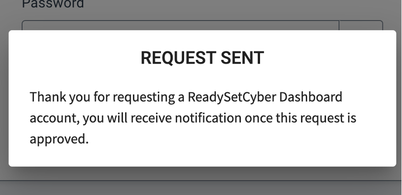

Access the e-mail address previously entered and visit the enclosed link to complete registration.

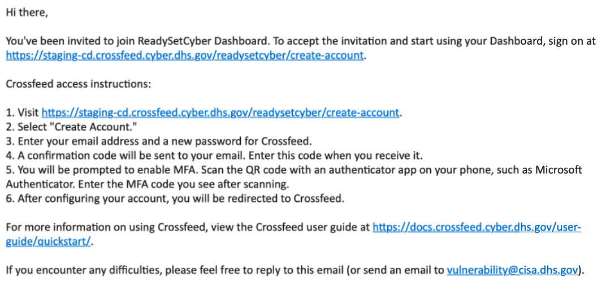

**Create Account:**

Complete the ”Create Account” fields with the email used for registration.

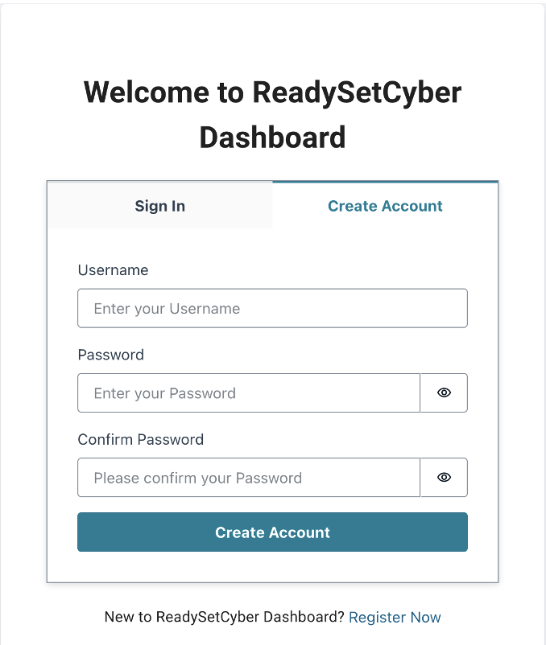

Once the fields have been completed, a confirmation code will be sent via e-mail to verify
ownership of the e-mail address.

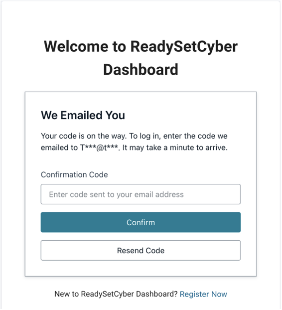

Enter the confirmation code received via e-mail and continue to setup Two-Factor Authentication.
Scan the QR Code on your mobile device to complete your account creation. Once Two-Factor Authentication has been completed, you will be directed to review and accept
the “Terms of Service”. Once the “Terms of Service” have been accepted and submitted, registration
is complete and you will be redirected to your ReadySetCyber Dashboard.

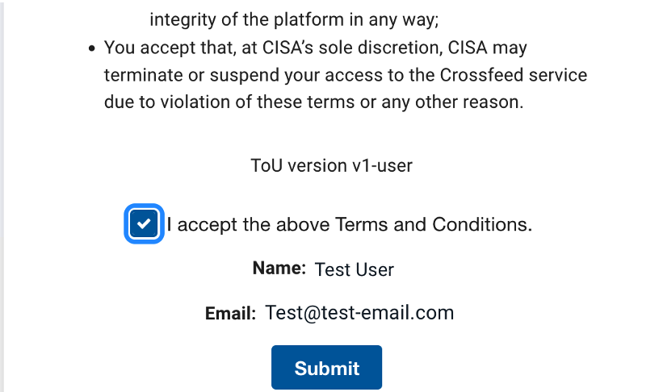

#### Existing Users

Once a user has completed the registration process and an assessment has been processed and
received by ReadySetCyber Dashboard, return to the dashboard login. Once successfully logged in,
a user will be directed to the dashboard view.

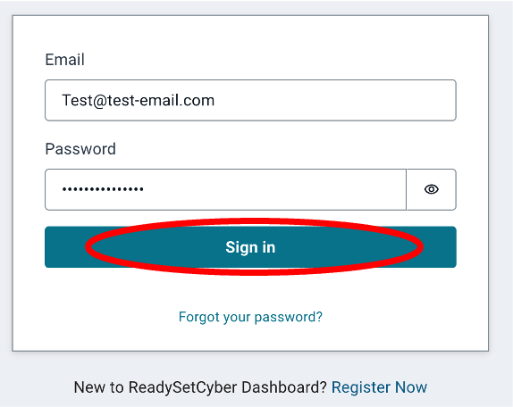

### Overview

Once you are logged in, you can view an overview of your past ReadySetCyber assessments.

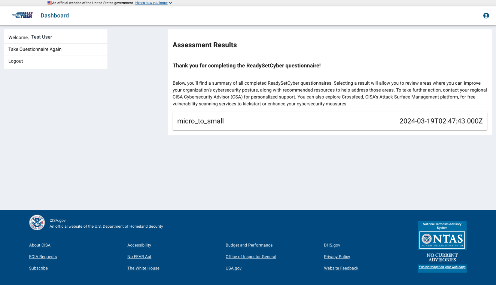

### Viewing assessment details

If an assessment has been processed and received by ReadySetCyber Dashboard, it will
be displayed as shown. To access a detailed view of your assessment, click on the
desired assessment.

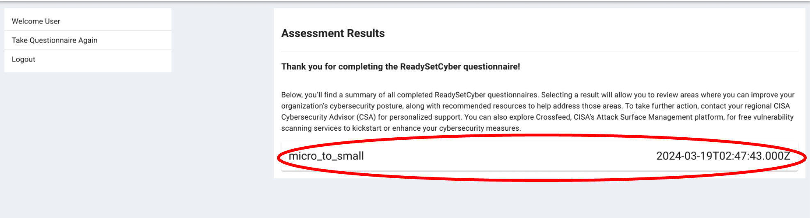

Details within an assessment result are displayed in the same format as the completed
questionnaire. Displayed answers correspond to answers submitted from a completed
ReadySetCyber questionnaire. You can save a copy of your completed assessment by clicking
on **Download PDF**

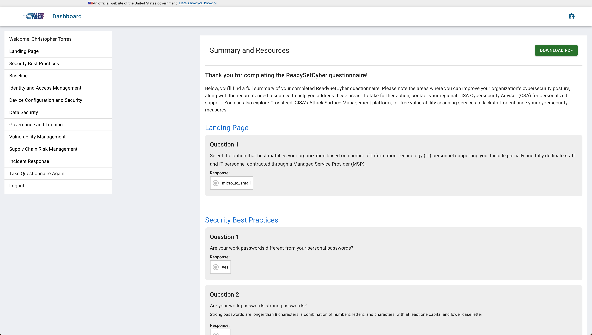

Responses marked “No”, “Not in Scope” or “Not Started” will display an associated
resource. Resource types will be displayed with a brief description and a clickable
link will be provided for all associated resources

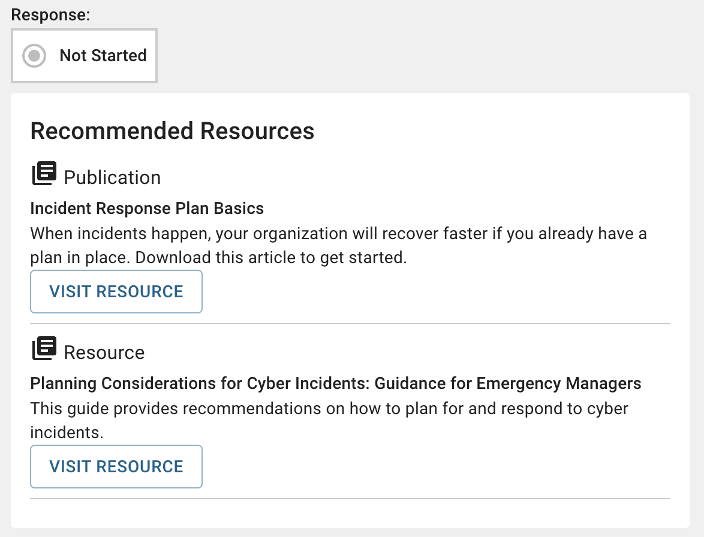

To quickly navigate through your assessment, a clickable side navigation and bottom navigation
are provided. Click the desired category to be taken there.

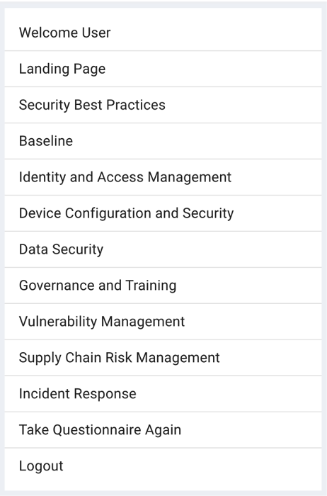
