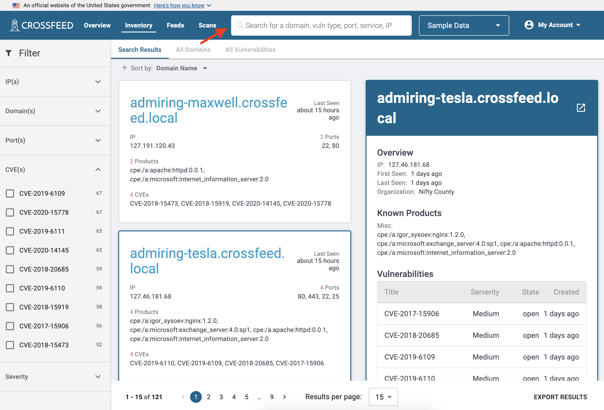

  

  <h4 class="usa-alert__heading">Note</h4>
    

      While CISA's instance of Crossfeed is currently not accepting public enrollment, it is developed as an open-source tool available on GitHub. The below instructions describe how users can use Crossfeed if granted access to CISA's instance of Crossfeed. If you are a developer and want to set up your own Crossfeed instance, see <a href="/dev/own-instance/">Creating your own instance of Crossfeed</a>.
    

  

### Overview

Once you are logged in, you can view an overview of your organization's domains and risk summary on the "Overview" panel. To list the available options, they are as follows:
- Latest Vulnerabilities
- Most Common Ports
- Open Vulnerabilities by Domain
- Severity Levels

### Viewing assets

Standard users can search their own inventory in a variety of ways, including by IP(s), Domains(s), and associated vulnerabilities. Each search result represents a domain, which can have ports, products, and vulnerabilities associated with it.

The "All Domains" list contains a more compact representation of all domains.

The "All Vulnerabilities" list has a list of all vulnerabilities. Each vulnerability is associated with a specific domain; vulnerabilities include CVEs as well as other issues such as SSL configuration or misconfiguration errors.

You can also view details of an individual domain.

Finally, you can click on a vulnerability to view more information, such as references to links and its history.

