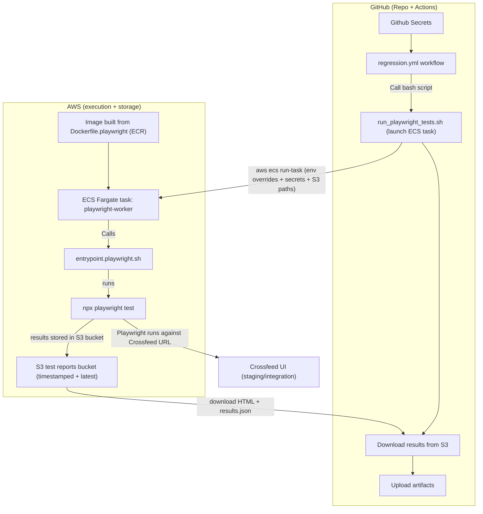

```mermaid
flowchart TB
  subgraph GH["GitHub (Repo + Actions)"]
    SECRETS["Github Secrets"]
    WORKFLOW["regression.yml workflow"]
    SHELL["run_playwright_tests.sh (launch ECS task)"]
    ARTIFACTS["Upload artifacts"]
    DOWNLOAD["Download results from S3"]
    WORKFLOW -->|"Call bash script"| SHELL
  end

  subgraph AWS["AWS (execution + storage)"]
    ECS["ECS Fargate task: playwright-worker"]
    IMG["Image built from Dockerfile.playwright (ECR)"]
    ENTRY["entrypoint.playwright.sh"]
    RUN["npx playwright test"]
    S3["S3 test reports bucket (timestamped + latest)"]
    IMG --> ECS
    ECS -->|"Calls"| ENTRY
    ENTRY -->|"runs"| RUN
    RUN -->|"results stored in S3 bucket"| S3
  end

  XFD["Crossfeed UI (staging/integration)"]
  SECRETS --> WORKFLOW
  SHELL -->|"aws ecs run-task (env overrides + secrets + S3 paths)"| ECS
  RUN -->|"Playwright runs against Crossfeed URL"| XFD
  S3 -->|"download HTML + results.json"| DOWNLOAD
  SHELL --> DOWNLOAD
  DOWNLOAD --> ARTIFACTS
```
