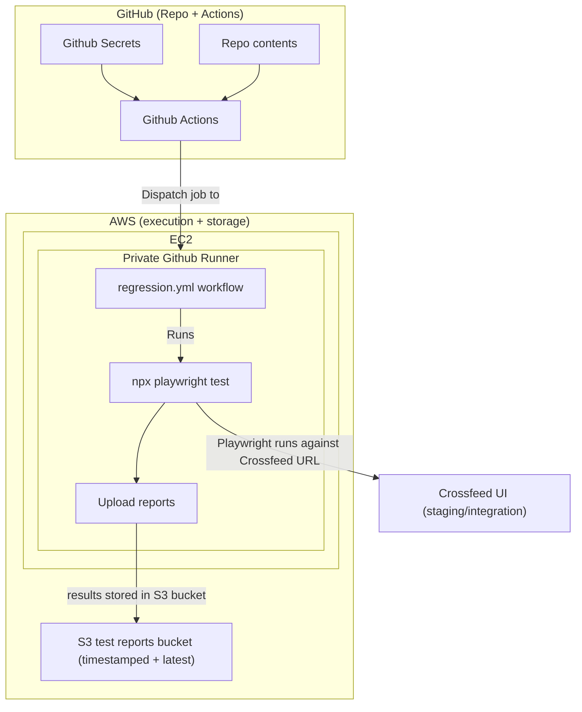

```mermaid
flowchart TB
  subgraph GH["GitHub (Repo + Actions)"]
    SECRETS["Github Secrets"]
    GHA["Github Actions"]
    CODE["Repo contents"]
    SECRETS --> GHA
    CODE --> GHA
  end

  subgraph AWS["AWS (execution + storage)"]
    subgraph EC2["EC2"]
      subgraph GH_RUNNER["Private Github Runner"]
            WORKFLOW["regression.yml workflow"] -->|"Runs"| RUN["npx playwright test"]
            RUN -->REPORT["Upload reports"]
      end
    end
    S3["S3 test reports bucket (timestamped + latest)"]
    REPORT -->|"results stored in S3 bucket"| S3
  end
  GHA -->|"Dispatch job to"| GH_RUNNER
  RUN -->|"Playwright runs against Crossfeed URL"| XFD["Crossfeed UI (staging/integration)"]
```
